# Plotr

Plotr was a web application built with Python and Django that allowed users to upload, analyze, visualize, and share that data. It was built for the purpose of learning Python and Django.

It once lived at plotr.ca, but now lives on only as source code here on github.

## Screenshots of plotr in action

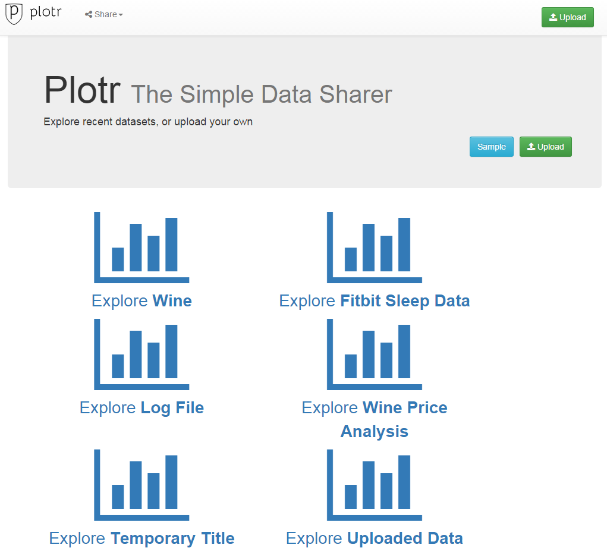
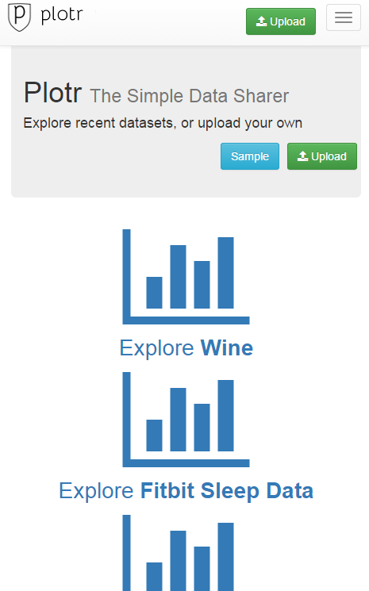
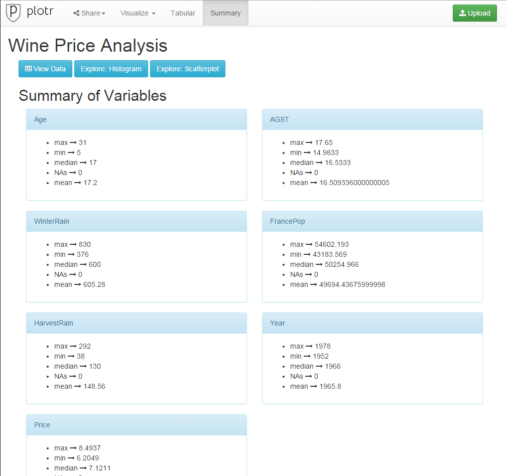
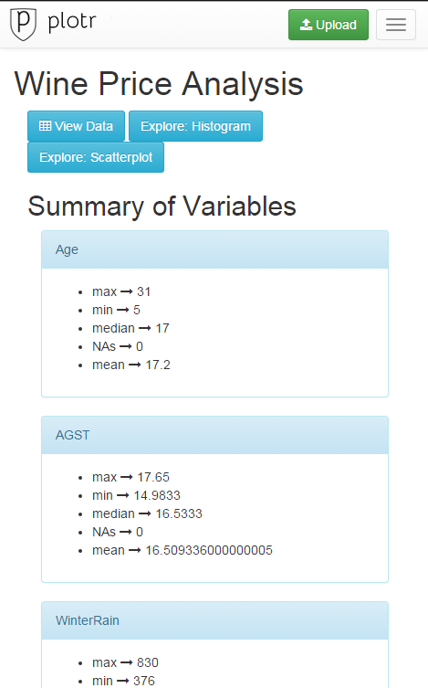
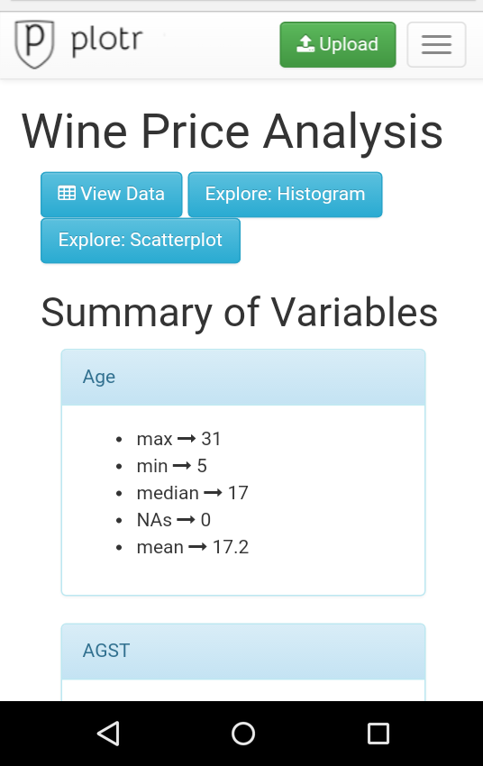
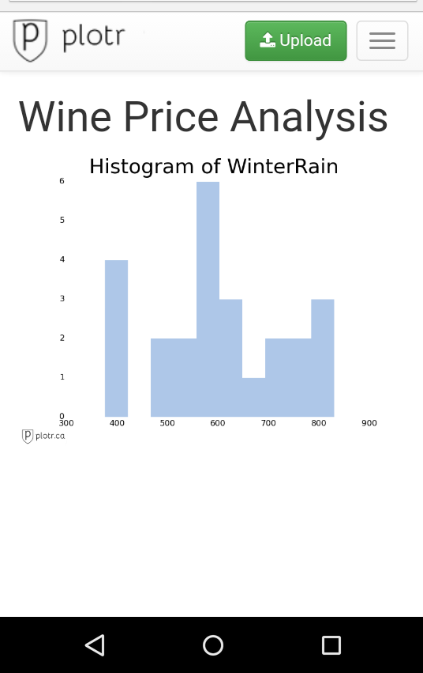
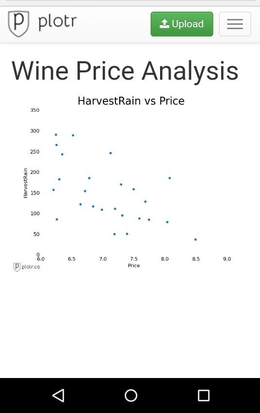
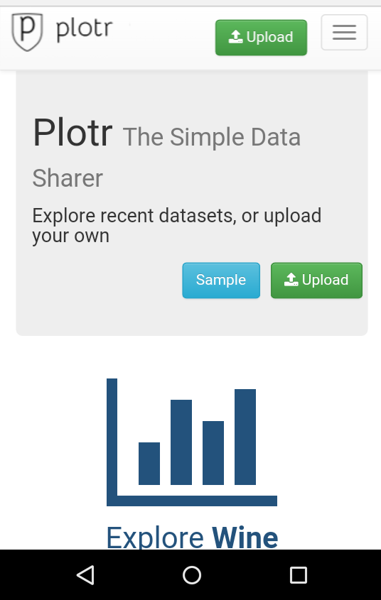
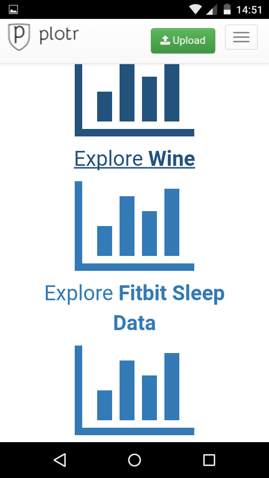
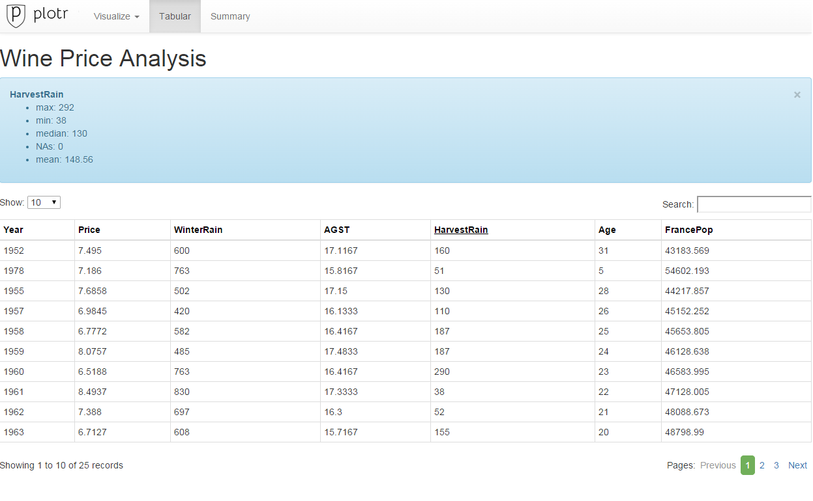
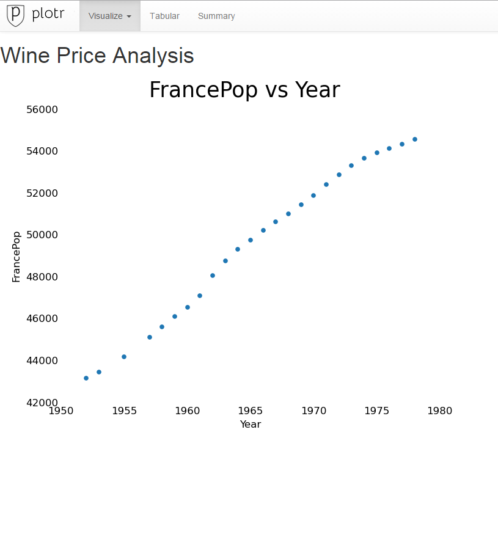
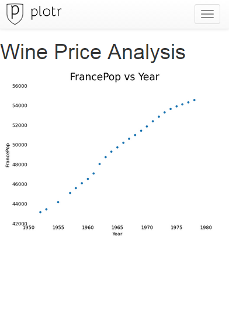